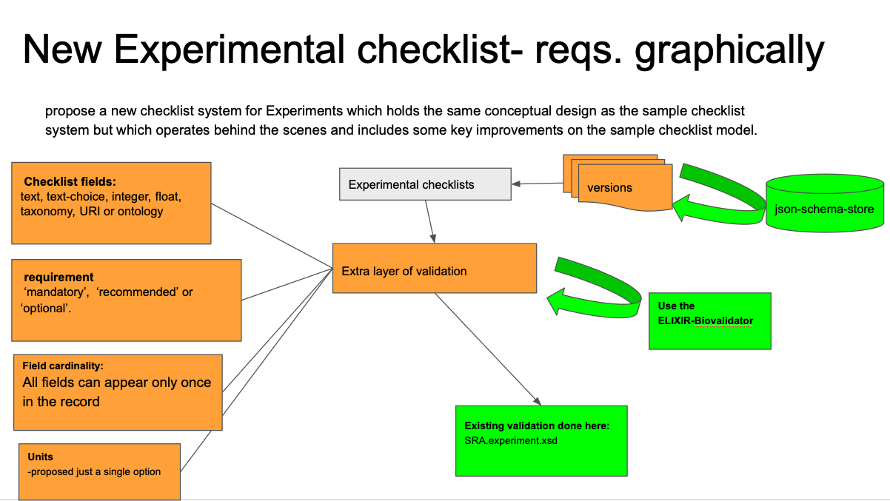

# This is the Experiment Checklist User Focused Documentation

N.B. this will probably go to READTHEDOCS

<!-- TOC -->
* [This is the Experiment Checklist User Focused Documentation](#this-is-the-experiment-checklist-user-focused-documentation)
  * [Introduction](#introduction)
  * [Key Features](#key-features)
  * [Technology chosen was JSON schema](#technology-chosen-was-json-schema)
  * [Overview of How We Intend this to Work](#overview-of-how-we-intend-this-to-work)
  * [Guide on How To Find the right Template and to Fill it out](#guide-on-how-to-find-the-right-template-and-to-fill-it-out)
  * [Specific Fields](#specific-fields)
    * [The custom fields](#the-custom-fields)
  * [Interfaces](#interfaces)
    * [filling templates manually](#filling-templates-manually)
    * [filling templates with a GUI?](#filling-templates-with-a-gui)
    * [filling templates programmatically](#filling-templates-programmatically)
  * [Validating](#validating)
  * [Introduction to Validating your Experiment metadata pre-submission](#introduction-to-validating-your-experiment-metadata-pre-submission)
    * [Internal Testing](#internal-testing)
<!-- TOC -->

## Introduction
The Experiment Checklists are an effort to create template to capture 
richer and more accurate metadata about experiments. The Sample Checklists have shown us how to usefully 
capture metadata, but also how to do this better.
* [See README.md](../README.md) for more information about the purpose of this. Also 
* [see the technical doc](ExperimentChecklistTechnicalDoc.md).

## Key Features
* a pair of JSON schema and JSON template per experiment type. The filled out template is validated against the schema. 
* details of what fields mandatory 
* conditional mandatory aspects allowed, e.g. if PCR then PCR values need to be provided.
* allowable controlled vocabulary 

## Technology chosen was JSON schema
JSON (JavaScript Object Notation) is simply a structured text format.  There are many advantages of JSON Schema over the older, but still venerable XML.
* JSON schema is more readily human-readable than XML. Both are machine-readable.
* Validation is very easy for things like controlled vocabularies.
* Dependency programming is relatively easy in JSON schema.

## Overview of How We Intend this to Work

* Programmatically manage the different Experiment Checklists
* Have each of the end product JSON checklists versioned.
* Have each of the end product JSON checklists validate, that can be immediately 
validated by user.

This generates JSON templates and JSON schemas for Experiment Checklists used for the ENA. There is a pair of JSON checklist template and JSON schema for each experiment type.
The aim is that we get higher quality metadata and due to the versioning we can just 
add improved JSON to future versions as needed, without worrying about backwards compatibility. 

## Guide on How To Find the right Template and to Fill it out

The list of templates can be seen here: TBD. 
1. Choose the template closest to your experiment type.
   1. Download it
   2. If questions, please contact the ENA helpdesk: https://www.ebi.ac.uk/ena/browser/support
2. Choose the interface you prefer: [Interfaces](#Interfaces)
3. Fill out a template for one or a few examples
4. Validate the filled out experiment template: [validating](#Validating)

## Specific Fields
### The custom fields
In the custom_fields area you have the opportunity to create your own field names and add a value.

The fields values will only be handled as strings. Your still put digits in there. There is a value length line of 256? characters. 

N.B. The metadata will be collected, archived and available as annotation. It will not be indexed though.

## Interfaces
TDB
### filling templates manually
TBD
### filling templates with a GUI?
TBD
### filling templates programmatically

## Validating
## Introduction to Validating your Experiment metadata pre-submission
   The use of JSON and JSON schemas allows for validation of format to be rapidly done by yourselves. This will rapidly find most kinds of data problems. 
Essentially what you will do is test your filled out JSON schema against the relevant JSON schema, e.g a METABARCODING template
will test against the METABARCODING schema.

A deeper validation will still be performed upon data submission. This is actually validated against XML schema(sra.experiment.xml and sra.common.xml). These are the single points of truth.
The JSON schema are dynamically built on a large subset of the XML schema contents, but have not been testing as thoughly as the underlying XML schema.

### Internal Testing
For this is it is necessary to:
* Have biovalidator installed and setup.

TBD

***
